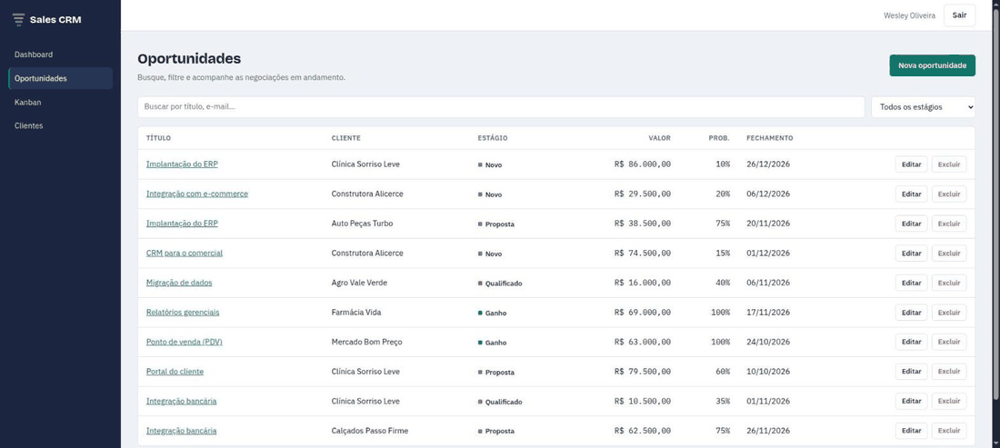
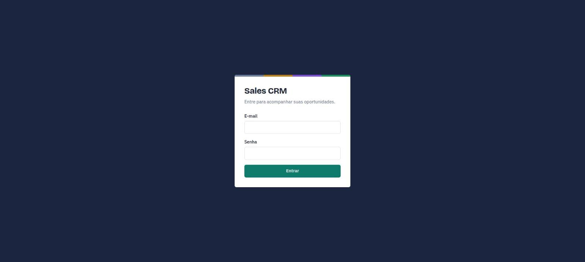
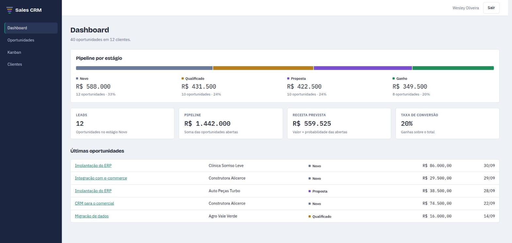
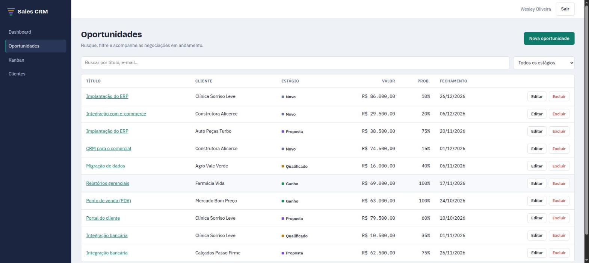
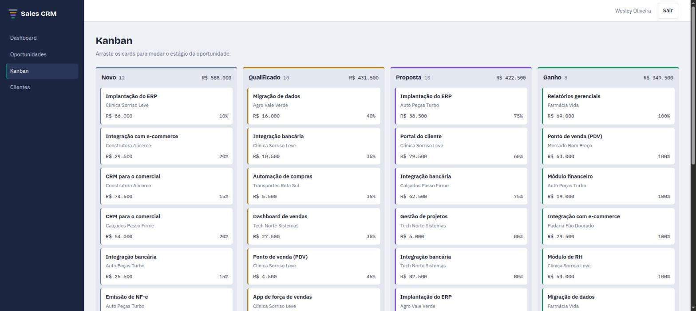
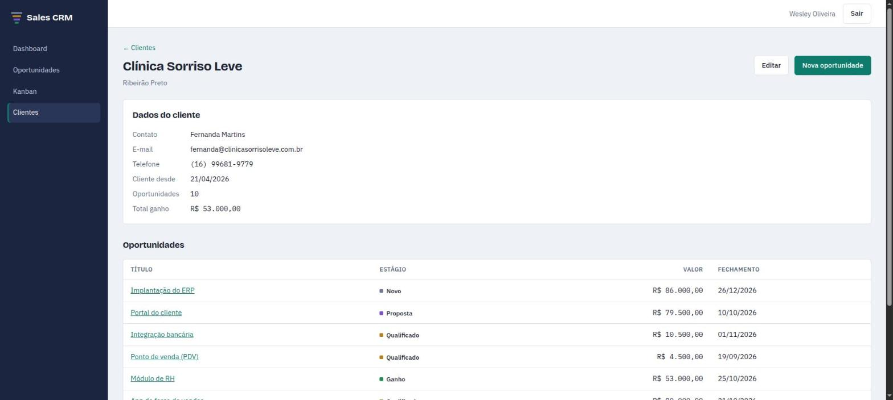

<h1 align="center">Sales CRM</h1>

    

 

Projeto desenvolvido durante meus estudos de Angular, onde construí um mini CRM de vendas inspirado nas aulas de Angular que tive em minha pós-graduação de Desenvolvimento Web Full Stack.

O sistema tem login, um dashboard com os principais números do funil, listagem de oportunidades com busca, filtro e paginação, cadastro e edição de oportunidades e clientes, e um kanban onde dá para arrastar as oportunidades entre os estágios. Os dados vêm de uma API REST com dados mockados feita com json-server.

<h3>Funcionalidades:</h3>
<ul>
    <li>Login com rotas protegidas</li>
    <li>Dashboard com leads, pipeline, receita prevista e taxa de conversão</li>
    <li>CRUD de oportunidades</li>
    <li>Busca, filtro por estágio e paginação (os filtros ficam na URL)</li>
    <li>Kanban do pipeline (Novo, Qualificado, Proposta e Ganho)</li>
    <li>Cadastro de clientes com as oportunidades de cada um</li>
</ul>

<h3>O que pratiquei nesse projeto:</h3>
<ul>
    <li>Standalone components</li>
    <li>Services e injeção de dependência com <code>inject()</code></li>
    <li>HttpClient consumindo uma API REST</li>
    <li>Reactive Forms com validações</li>
    <li>Angular Router, parâmetros de rota, query params e lazy loading</li>
    <li>Route guard para autenticação</li>
    <li>Interceptors funcionais para o token e para tratamento de erros</li>
    <li>RxJS: <code>debounceTime</code>, <code>distinctUntilChanged</code>, <code>switchMap</code>, <code>combineLatest</code>, <code>forkJoin</code>, <code>catchError</code> e <code>finalize</code></li>
    <li>Signals: <code>signal()</code>, <code>computed()</code> e <code>input()</code></li>
    <li>Testes unitários com Vitest</li>
</ul>

<h3>Tecnologias utilizadas:</h3>
<ul>
    <li><a href="https://angular.dev/">Angular</a></li>
    <li><a href="https://www.typescriptlang.org/">TypeScript</a></li>
    <li><a href="https://rxjs.dev/">RxJS</a></li>
    <li><a href="https://material.angular.dev/cdk/categories">Angular CDK</a></li>
    <li><a href="https://github.com/typicode/json-server">JSON Server</a></li>
    <li><a href="https://sass-lang.com/">SCSS</a></li>
    <li><a href="https://vitest.dev/">Vitest</a></li>
</ul>

<h3>Telas</h3>

<h3>Instalação e Inicialização</h3>

É preciso ter o Node.js 22 ou superior instalado.

<code>git clone https://github.com/WesleyOliveira98/crm-angular.git</code>  
<code>cd crm-angular</code>  
<code>npm install</code>  
<code>npm start</code>

O comando sobe o Angular em <code>http://localhost:4200</code> e a API com dados mockados em <code>http://localhost:3000</code>. Para rodar os testes use <code>npm test</code>.

Tudo que você cadastrar ou alterar fica salvo no arquivo <code>server/db.json</code>. Se quiser voltar para os dados originais é só rodar <code>git checkout server/db.json</code> com a API parada.

<h3>Acesso</h3>

Para entrar no sistema use o e-mail <code>admin@crm.com</code> e a senha <code>123456</code>. O login é só para fins de estudo, o token é fake e não existe nenhum dado real.

